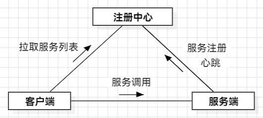
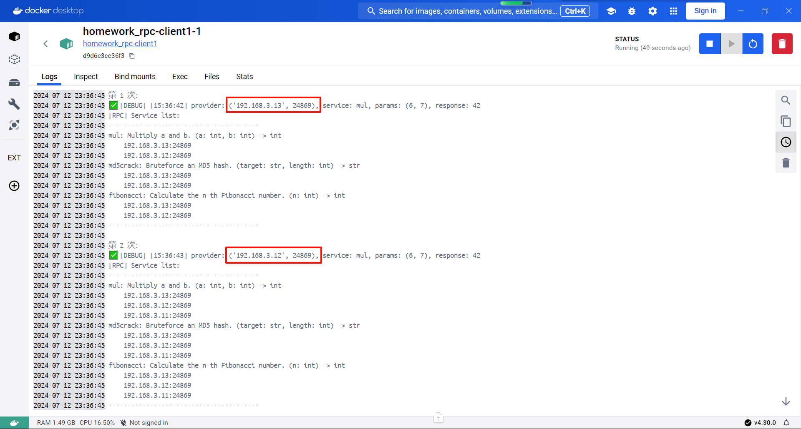
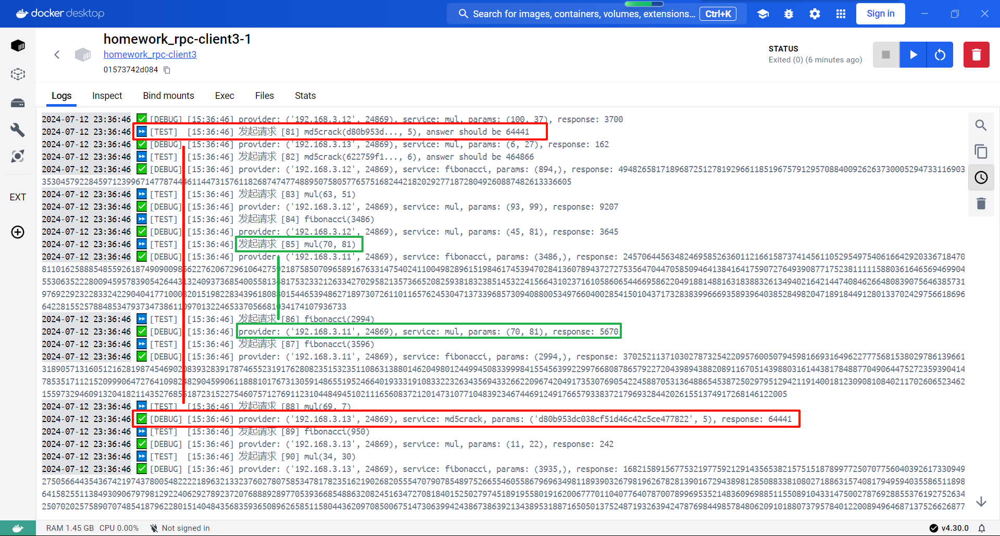
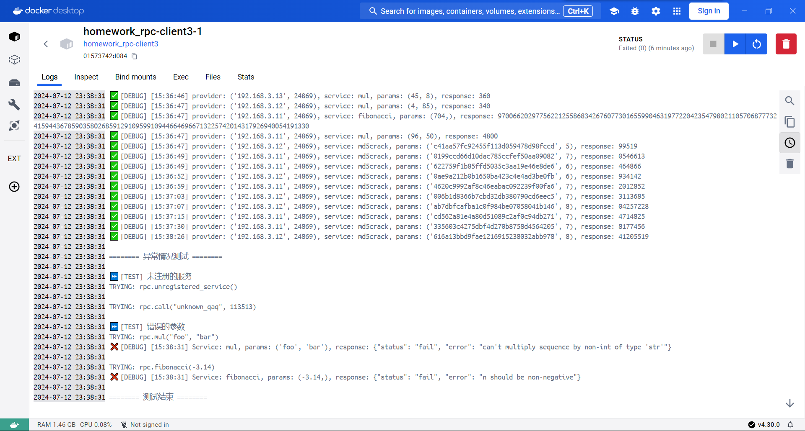

<h1><center>RPC设计与实现文档</center></h1>

<center>《计算机网络》课程作业</center>

[TOC]

## 一、文件结构与部署

本实现包含**客户端模块**、**注册中心程序**、**服务端程序**三部分。注册中心只有一个，客户端和服务器分别可以有一个或多个。三部分可分离部署、可运行在任意端口上。



程序中导入的全部模块均为 Python 自带，不依赖任何第三方库。注意：仅在 Python 3.12 版本做了测试，已知用到的一部分 f-string 语法在 3.10 版本中不支持。

```plaintext
client
├── client_core.py            <客户端核心模块，一般不需要修改，需被用户程序导入>
├── client_test.py            <此处是测试程序，实际使用中请替换为用户程序>
└── config.json               <客户端配置文件>

register-center
├── reg_center_main.py        <注册中心主程序，一般不需要修改>
└── config.json               <注册中心配置文件>

server
├── server_main.py            <服务端主程序，一般不需要修改>
├── config.json               <服务端配置文件>
└── services
    ├── __init__.py           <服务列表>
    ├── mul.py                <服务具体实现>
    ├── fibonacci.py
    └── md5crack.py
```

## 二、使用方法

***为方便测试，已提供 `docker-compose.yml` 文件。***

### 2.1 注册中心

注册中心程序是 Python 脚本，直接运行即可。

```bash
python reg_center_main.py
```

#### 2.1.1 配置文件

```json
{
    "listen": {               // 监听地址
        "host": "0.0.0.0",
        "port": 34869
    },
    "max_tries": 5,           // 最大尝试次数
    "max_workers": 16         // 最大工作线程数
}
```

### 2.2 客户端

客户端提供的是 Python 模块，在用户编写的程序中导入该模块即可使用。示例：

```python
from client_core import MyRPC

rpc = MyRPC()
# rpc.pull() will be called automatically

rpc.print_list()

x = rpc.mul(6, 7)
# or: x = rpc.call('mul', 6, 7)
# x is 42
```

如果直接运行此模块、而不是被导入，会打印出上述提示信息并退出。

***作业中为方便测试，写好了 `client_test.py` 作为用户程序。详见 “九、测试”。***

通过 Python 的 `__getattribute__` 和 `__call__` 魔术方法，实现了方便用户使用的**语法糖**，已有的程序只需稍加修改即可变成远程调用。例如对于本地调用 `mul(6, 7)`，前面加上 MyRPC 对象名，就变成了远程调用 `rpc.mul(6, 7)`。也可写成 `rpc.call('mul', 6, 7)`。

#### 2.2.1 异常

在调试模式下会打印异常信息，非调试模式下会向用户抛出异常，需由用户代码处理：

- 调用不存在的服务时，抛出 `ModuleNotFoundError`
- 服务端返回状态非 `success` 时，抛出 `ValueError`
- TCP 连接或 JSON 解析产生的异常可能向用户传播

#### 2.2.2 配置文件

```json
{
    // 注册中心地址；可被构造函数 MyRPC((host, port)) 覆盖
    "register": {
        "host": "192.168.3.100",
        "port": 34869
    },
    // 拉取服务列表最长有效期（秒）
    "service_list_ttl": 1,
    // 最大尝试次数
    "max_tries": 3
}
```

### 2.3 服务端

服务端程序是 Python 脚本，直接运行即可。

```bash
python server_main.py
```

#### 2.3.1 配置文件

```json
{
    "listen": {                      // 监听地址
        "host": "0.0.0.0",
        "port": 24869
    },
    "register": {                    // 注册中心地址
        "host": "192.168.3.100",
        "port": 34869
    },
    "max_tries": 5,                  // 最大尝试次数
    "max_workers": 16,               // 最大工作线程数
    "heartbeat_interval": 3          // 心跳间隔时间（秒）
}
```

#### 2.3.2 服务管理

增加/删除/修改服务时，**只需进行少量修改**：将实现了 `handler(params)` 函数的 Python 文件放在 `services` 文件夹，并修改 `__init__.py`，重启服务端程序即可。**不需修改核心代码或配置文件**。示例：

`mul.py`:

```python
__doc__ = 'Multiply a and b. (a: int, b: int) -> int'

def handler(params):
    return params[0] * params[1]
```

`__init__.py`:

```python
from . import mul, md5crack, fibonacci

service_list = {
    'mul': mul,
    'md5crack': md5crack,
    'fibonacci': fibonacci
}
```

***作业中为方便测试，预设三项服务。详见 “九、测试”。***

## 三、数据结构

### 3.1 客户端

每个 MyRPC 对象会分别维护注册中心地址、服务列表、上次尝试拉取服务列表时间戳。服务列表结构：

```json
{
    "last_update": <timestamp>,
    "services": {
        "<service1-name>": {
            "detail": "<service1-detail>",
            "provider": [
                (<ip1>, <port1>),
                (<ip2>, <port2>), ...
            ]
        },
        "<service2-name>": ...
    }
}
```

### 3.2 服务端

服务端在启动时导入服务列表，其结构在 “二、使用方法” - “服务管理” 中已经介绍。除此之外，服务器不维护任何状态（服务本身可以有自己的状态，例如斐波那契数列会保存已经计算的数据，以便复用）。

### 3.3 注册中心

注册中心维护一个已注册服务器的列表，结构如下：

```json
{
    "<ip1>": {
        "last_heartbeat": <timestamp>,
        "port": <port1>,
        "services": [
            {
                "name": "<service1-name>",
                "detail": "<service1-detail>"
            }, ...
        ]
    },
    "<ip2>": ...
}
```

即使某一服务器不再发送心跳，该服务器仍然会保留在列表中。每次响应客户端的拉取请求时，遍历服务列表，超时未心跳的服务器不发送给客户端。

## 四、通信策略

通过 TCP 协议，请求-响应模式通信。

不复用连接，因为两端都使用线程池（见 “七、并发”），如果复用连接，则需额外的事务编号字段、也需额外的线程来统一接收响应消息，然后派发响应消息到发出请求的线程，会把问题复杂化。

注册中心只监听端口、响应请求，不主动向客户端或服务端发送请求。

服务端只在启动时或心跳失败时进行注册；用一个线程每隔一定时间（为方便测试，默认为3秒）发送心跳，心跳中不含服务信息；剩下的线程接受客户端的服务请求，并响应。如果服务停止，不发送心跳即可。

客户端不监听端口，只在需要时发出请求，并对应获取一次响应。客户端从注册中心得到的是每个服务的提供者地址，直接向服务端发请求，不经过注册中心。客户端拉取服务列表的时机：①MyRPC类实例化时；②发现需要的服务项不在列表中时；③无法与服务端建立连接时；④服务列表过期时。

## 五、消息格式

使用 JSON 格式发送消息，格式如下：

### 5.1 注册请求（服务器->注册中心）

```json
{
    "type": "reg",
    "port": <server-port>,         // IP 由注册中心从 TCP 连接获取
    "services": [
        {
            "name": "<service1-name>",
            "detail": "<service1-detail>"
        },
        {
            "name": "<service2-name>",
            "detail": "<service2-detail>"
        }
    ]
}
```

### 5.2 心跳请求（服务器->注册中心）

```json
{
    "type": "heartbeat"
}
```

### 5.3 注册或心跳响应（注册中心->服务器）

```json
{
    "status": "success"
    // "status": "fail", "error": "<error-message>"
}
```

### 5.4 拉取服务列表请求（客户端->注册中心）

```json
{
    "type": "pull"
}
```

### 5.5 拉取服务列表响应（注册中心->客户端）

```json
{
    "status": "success",   // "fail"
    "servers": [
        {
            "ip": "<provider1-ip>",
            "port": <provider1-port>,
            "services": [
                {
                    "name": "<service1-name>",
                    "detail": "<service1-detail>"
                },
                {
                    "name": "<service2-name>",
                    "detail": "<service2-detail>"
                }
            ]
        },
        {
            "ip": "<provider2-ip>",
            "port": <provider2-port>,
            "services": [
                {
                    "name": "<service3-name>",
                    "detail": "<service3-detail>"
                },
                {
                    "name": "<service3-name>",
                    "detail": "<service3-detail>"
                }
            ]
        }
    ]
}
```

### 5.6 调用请求（客户端->服务器）

```json
{
    "type": "req",
    "service": "<service-name>",
    "params": [...]
}
```

### 5.7 调用响应（服务器->客户端）

```json
{
    "status": "success",   // "status": "fail"
    "result": ...          // "error": "<error-message>"
}
```

## 六、调度

采用不同请求随机、同一请求出错时轮询的方式，选择一个服务提供者。

客户端有一个完整的（可能不是最新的）服务列表，每次请求时，将相应服务的提供者列表复制一份并随机打乱，向打乱后的第一个提供者发送请求。如果通信失败，则继续向列表中的下一个提供者发送请求，直到成功或尝试次数用完为止。

例如，提供者列表被打乱为 [3, 1, 2]，最大尝试次数为5。则最坏情况下会依次请求 3, 1, 2, 3, 1。

这样可以避免连续向一个（可能停止的）提供者发送请求。

另外，在第一次失败时，也会重新向注册中心拉取服务列表。

客户端并不会每次请求时都拉取服务列表，这样可以减少注册中心的负担。服务列表会过期，这样新注册的服务器就有机会逐渐被客户端知道。只有在服务列表过期或无法连接服务端时，客户端才会重新拉取服务列表。

## 七、并发

在注册中心与服务端都使用线程池。线程池中最大线程数在配置文件中设置，默认为16。每次在接收到请求时，会派发到其中一个线程上处理。

测试结果表明，该并发处理可以使短任务（如两数乘法）快速响应，而长任务（如 MD5 原文爆破）不会阻塞其他请求。详见 “九、测试”。

## 八、异常处理

### 8.1 服务端/注册中心-监听端口

如果无法绑定并监听指定端口，会在标准错误上打印日志，并等待3秒后重试，连续失败一定次数（默认为5次）后停止运行。

### 8.2 服务端-注册/心跳

每次心跳失败时，会尝试重新注册，然后再发送心跳。

每次注册失败时，会等待3秒后，尝试重新注册。

如果注册连续失败一定次数（默认为5次）后，这被认为是严重的问题，因为会导致客户端不知道服务端的存在，进而没有请求发向服务端，服务端空转。所以服务端会停止运行。

### 8.3 服务端-响应请求

服务端会判断请求方法是否合法、请求的服务名称是否存在。如果不合法，会尝试返回错误信息给客户端。如果具体服务抛出异常，会将异常信息封装后返回给客户端。

### 8.4 注册中心-接收心跳

如果注册中心找不到心跳对应的服务列表，会返回错误，这样服务器就会重新注册。

注册中心在响应客户端发起的拉取服务列表请求时，会遍历服务列表，超时未心跳的服务器不发送给客户端。这样就不需要经常主动检查每个服务器是否已心跳。

### 8.5 客户端-拉取服务列表

客户端在拉取服务列表时，如果失败，会保持原有服务列表不变（启动时则保持为空），而不是报错。在确实有需要时，再次尝试拉取。特别的，两次拉取必须间隔1秒以上，以免对注册中心频繁发出请求。这样可以保证客户端不会因为注册中心的问题而无法使用。

### 8.6 客户端-请求服务

如果请求失败，会轮询下一个提供者（见 “六、调度”），同时拉取新的服务列表。特别地，在无法连接注册中心的时候，过期的服务列表是可以接受的。

## 九、测试

在测试中预设了三项服务：

- 两数相乘（容易验证正确性）
- 斐波那契数列（服务器可缓存已经计算的部分数据，并在下次请求时快速响应；由于多线程的存在需要使用互斥锁）
- MD5 原文爆破（8位十进制数的时候需要计算几秒，可以验证服务器是否会阻塞其他请求）

### 9.1 启动阶段

由于测试中客户端与服务器是同时启动的，可能存在服务器还没有注册到注册中心，客户端就开始请求的情况。如果服务列表不可用，客户端会再次拉取服务列表，但两次拉取必须至少间隔1秒（见 “八、异常处理”）。

测试结果表明，客户端可在服务列表更新后，正确地调度。



### 9.2  16 线程随机发起 100 次调用

测试结果表明，短任务（两数相乘）可以快速响应，长任务（MD5 原文爆破）不会阻塞其他请求。



### 9.3 异常处理

测试结果表明，能按照预期处理异常，不会因崩溃退出。


